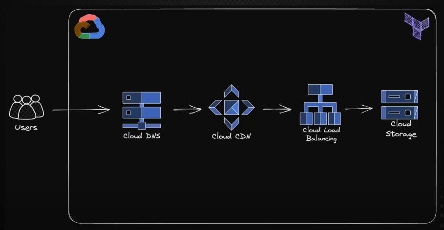

# Terraform With GCP



### Install
```bash
brew tap hashicorp/tap
brew install hashicorp/tap/terraform
```


### Config
#### Enable
- Cloud DNS API
- Compute Engine API
- IAM API

#### Create service account for Terraform
IAM & Admin -> Service accounts -> key -> json


### Run
```bash
cd infra
terraform init
terraform plan
```

##### Reference
- [freecodecamp-terraform-with-gcp](https://github.com/rishabkumar7/freecodecamp-terraform-with-gcp)
